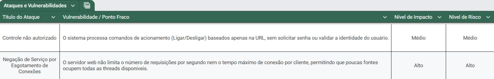
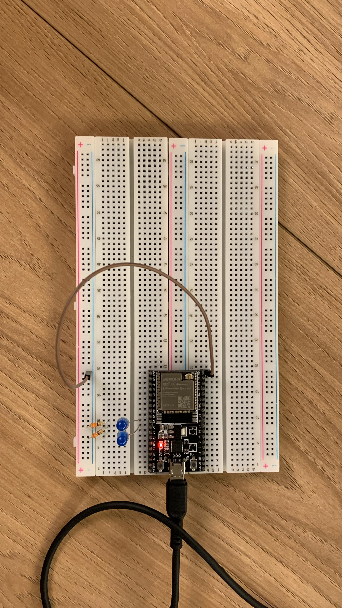
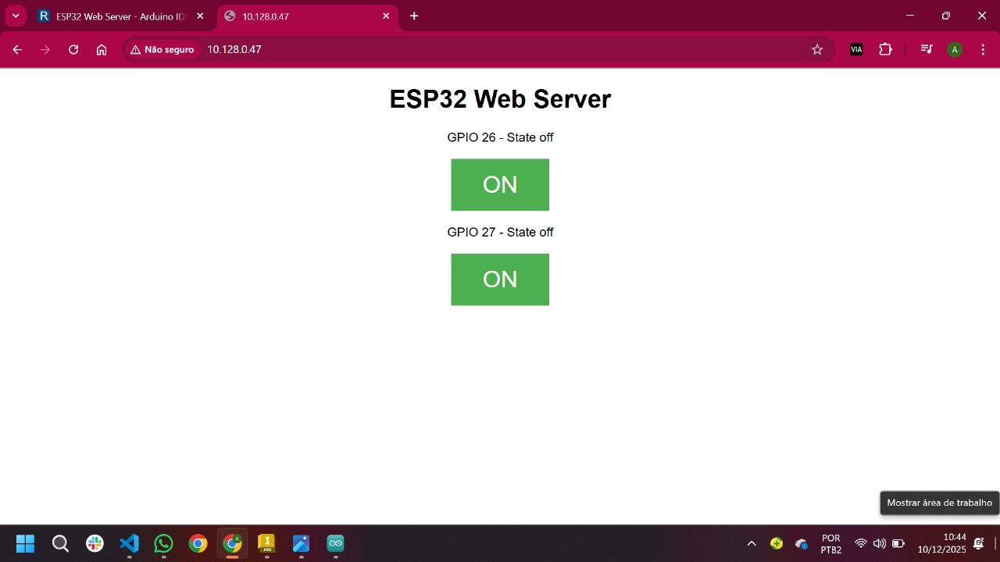
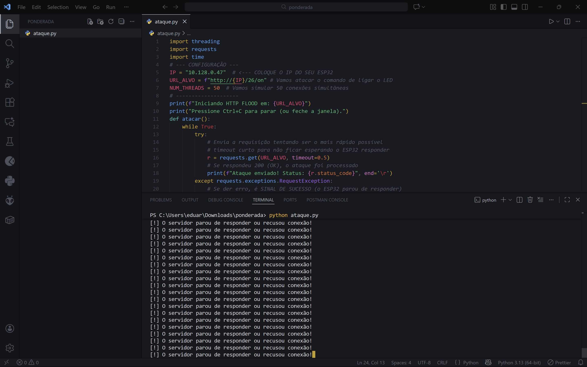
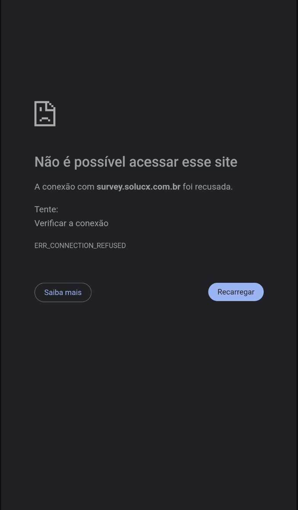

# Relatório Técnico de Análise de Segurança: Servidor Web ESP32

## Shelley 

<div align="center">

  <br>

</div>

## Sumário

<a href="#c1">1. Introdução</a>

<a href="#c2">2. Modelo de Ameaça</a>

<a href="#c3">3. Análise Estática do Código e Identificação de Vulnerabilidades</a>

<a href="#c4">4. Análise de Ataques</a>

<a href="#c5">5. Tabela Consolidada de Riscos</a>

<a href="#c6">6. Análise Dinâmica (Ir Além)</a>

<a href="#c7">7. Recomendações e Mitigações</a>

<a href="#c8">8. Conclusão</a>

<a href="#c9">9. Referências</a>

<br>

<div align="center">

  <br>

</div>

<br>

## <a name="c1"></a> 1. Introdução

Este relatório técnico apresenta a análise de segurança de um servidor web implementado em um microcontrolador ESP32 utilizando a IDE Arduino. O documento contém análise estática, identificação de vulnerabilidades, modelagem de ataques, avaliação de risco, tabela consolidada e análise dinâmica (“Ir Além”).

O código estudado refere-se ao exemplo do tutorial:  
`https://randomnerdtutorials.com/esp32-web-server-arduino-ide/`

_O sistema permite o controle dos GPIOs 26 e 27 por meio de requisições HTTP via rede local._

---

## <a name="c2"></a> 2. Modelo de Ameaça

Para contextualização das análises, adota-se o seguinte modelo de ameaça:

- O atacante tem acesso à **mesma rede local (Wi-Fi)** que o ESP32.  
- Não se considera ataque via Internet nem acesso físico ao dispositivo.  
- Assume-se que o atacante possui conhecimento básico sobre HTTP, portas de rede e endereços IP.  

Esse modelo reflete cenários reais em ambientes IoT domésticos, educacionais e de prototipagem.

---

## <a name="c3"></a> 3. Análise Estática do Código e Identificação de Vulnerabilidades

A análise estática do código identificou duas vulnerabilidades principais que comprometem diretamente a segurança da aplicação. Ambas estão apresentadas na tabela a seguir, acompanhadas de uma descrição detalhada que esclarece sua natureza, suas causas e seus potenciais impactos sobre o funcionamento do sistema.

<div align="center">

  <br>

</div>

---

### 3.1. Vulnerabilidade 1: Falta de Autenticação e Autorização (CWE-287)

O código não implementa qualquer forma de autenticação. Assim, qualquer usuário conectado à rede pode enviar comandos válidos para controlar os GPIOs.

**Evidência no código:**
A lógica de controle dentro da função `loop()` é executada imediatamente após a recepção do cabeçalho HTTP:

```cpp
// turns the GPIOs on and off
if (header.indexOf("GET /26/on") >= 0) {
  Serial.println("GPIO 26 on");
  output26State = "on";
  digitalWrite(output26, HIGH);
} else if (header.indexOf("GET /26/off") >= 0) {
// ... e assim por diante para os outros comandos
```

**Ponto Fraco:** Qualquer dispositivo conectado à mesma rede Wi-Fi que conheça o endereço IP do ESP32 pode enviar comandos para ligar ou desligar os GPIOs, comprometendo a integridade do sistema controlado.

**Mitigação recomendada:** Implementar autenticação HTTP Basic, tokens, ou outra forma simples de autorização.

---

### 3.2. Vulnerabilidade 2: Falta de Limitação no Buffer de Entrada (CWE-119 / CWE-789)

O cabeçalho HTTP recebido é armazenado em uma variável String sem controle de tamanho. Isso permite ao atacante enviar headers extremamente extensos, consumindo a memória heap do microcontrolador.

**Evidência no código:**
A leitura de cada caractere do cliente é concatenada diretamente à variável `header`:

```cpp
char c = client.read();             // read a byte, then...
header += c;
```

**Ponto Fraco:** A classe `String` do Arduino utiliza alocação dinâmica de memória (heap). Se um atacante enviar um cabeçalho HTTP excessivamente longo, a alocação contínua de memória pode esgotar o *heap* disponível do ESP32, levando a uma falha de alocação e, consequentemente, a um *crash* do sistema ou a um comportamento instável.

**Mitigação recomendada:** Definir tamanho máximo para o cabeçalho ou utilizar buffers estáticos.

---

## <a name="c4"></a> 4. Análise de Ataques

Com base nas vulnerabilidades identificadas, são descritos dois ataques distintos, incluindo passo-a-passo, impacto, probabilidade e risco.

---

### 4.1. Ataque 1: Controle Não Autorizado dos GPIOs

**Descrição:** Explora a ausência de autenticação para ativar ou desativar GPIOs sem permissão, o que citamos na **Vulnerabilidade 1 (Falta de Autenticação)**.

**Passo-a-passo:**

1.  **Identificação do Alvo:** O atacante descobre o endereço IP do ESP32 na rede local (ex: `192.168.1.100`).

2.  **Descoberta de Comandos:** O atacante infere ou observa os comandos de controle de GPIOs (ex: `/26/on`, `/27/off`).

3.  **Execução:** O atacante envia uma requisição HTTP simples para o ESP32 com o comando desejado.
    *   *Exemplo de Requisição (via navegador ou `curl`):*
        ```
        http://192.168.1.100/26/on
        ```

4.  **Resultado:** O ESP32 executa o comando `digitalWrite(output26, HIGH);`, ligando o dispositivo conectado ao GPIO 26, sem que o usuário legítimo seja notificado ou tenha dado permissão.

#### Avaliação de Risco:

| Métrica | Valor | Justificativa |
| :--- | :--- | :--- |
| **Probabilidade** | **Média (2)** | A vulnerabilidade é óbvia, mas o ataque requer que o atacante esteja na mesma rede local (limitação de escopo). A simplicidade do comando aumenta a probabilidade de exploração. |
| **Impacto** | **Médio (2)** | O impacto é a perda de controle sobre os dispositivos físicos conectados. Em um cenário de automação residencial, isso pode significar ligar/desligar luzes, abrir portas ou acionar relés de forma indevida. O impacto é limitado aos dispositivos controlados. |
| **Risco** | **Moderado (4)** | O risco é moderado. Embora o impacto possa ser significativo dependendo do que está conectado, a necessidade de acesso à rede local e o impacto limitado (apenas controle de GPIOs) o tornam menos crítico que a indisponibilidade total. |

---

### 4.2. Ataque 2: Exaustão de Memória (Denial of Service – DoS)

**Descrição:** O atacante envia um cabeçalho HTTP extremamente longo, explorando a ausência de limitação no buffer. O ESP32 tenta armazenar todos os caracteres, levando ao esgotamento do heap, o que citamos na **Vulnerabilidade 2 (Falha na Limitação de Buffer)**, e assim, causa uma negação de serviço (DoS) por exaustão de recursos de memória.

**Passo-a-passo:**

1.  **Identificação do Alvo:** O atacante descobre o endereço IP do ESP32 na rede local (ex: `192.168.1.100`).

2.  **Criação da Requisição Maliciosa:** O atacante utiliza uma ferramenta (ex: `netcat`, `curl` ou um script Python) para enviar uma requisição HTTP com um cabeçalho extremamente longo. O cabeçalho pode ser composto por um campo HTTP não padrão repetido milhares de vezes.
    *   *Exemplo de Requisição:*
        ```
        GET / HTTP/1.1
        Host: 192.168.1.100
        X-Long-Header: AAAAAAAAAAAAAAAAAAAAAAAAAAAAAAAAAAAAAAAAAAAAAAAAA... (milhares de 'A')
        \r\n\r\n
        ```

3.  **Execução:** O ESP32 recebe a requisição. A linha `header += c;` tenta alocar e concatenar a *string* gigantesca na memória *heap*.

4.  **Resultado:** O ESP32 esgota sua memória RAM disponível, a alocação falha, e o dispositivo entra em um estado de falha (possivelmente um *reboot* ou *crash*), tornando o servidor web indisponível.

#### Avaliação de Risco:

| Métrica | Valor | Justificativa |
| :--- | :--- | :--- |
| **Probabilidade** | **Alta (3)** | A execução é trivial e não requer conhecimento avançado. Qualquer cliente na rede pode enviar uma requisição longa. A vulnerabilidade é uma falha de design fundamental no tratamento de entrada. |
| **Impacto** | **Alto (3)** | O resultado é a indisponibilidade total do servidor web e, potencialmente, o *crash* do microcontrolador, exigindo um *reboot* manual ou automático para recuperação. Isso interrompe todas as funcionalidades do dispositivo. |
| **Risco** | **Crítico (9)** | A combinação de alta probabilidade e alto impacto resulta em um risco crítico, pois a falha pode ser explorada facilmente para desativar o dispositivo. |

---

## <a name="c5"></a> 5. Tabela Consolidada de Riscos

A tabela a seguir apresenta a classificação dos ataques em ordem decrescente de risco:

| Título do Ataque | Probabilidade (P) | Impacto (I) | Risco (R = P x I) |
| :--- | :--- | :--- | :--- |
| **1. Consumo de Memória (DoS)** | Alta (3) | Alto (3) | **Crítico (9)** |
| **2. Controle Não Autorizado de GPIOs** | Média (2) | Médio (2) | **Moderado (4)** |

**Escala de Risco:**
*   **Baixo:** 1-2
*   **Moderado:** 3-4
*   **Crítico:** 6-9

**Fórmula Utilizada:**
- Risco = Probabilidade × Impacto

---

## <a name="c6"></a> 6. Análise Dinâmica (Ir Além)

Esta seção documenta a realização prática de um ataque ao ESP32 utilizando montagem em protoboard e coleta de evidências.

---

### 6.1. Montagem em Protoboard

Nessa seção se encontra a foto da montagem do circuito físico localizado em `https://randomnerdtutorials.com/esp32-web-server-arduino-ide/`.

<br>

**📷 [FOTO 1 – Montagem Física do Circuito]**

<div align="center">

  <br>

</div>

---

### 6.2. Execução do Ataque Testado: Exaustão de Memória (DoS)

#### Passo-a-passo:

1.  **Identificação do Alvo:** O atacante descobre o endereço IP do ESP32 na rede local (ex: `192.168.1.100`).

<br>

**📷 [FOTO 2 – Serviço Web Online]**

<div align="center">

  <br>

</div>

<br>

```
Endereço IP do ESP32: 10.182.0.47.
```

<br>

2.  **Criação da Requisição Maliciosa:** O atacante utiliza uma ferramenta (ex: `netcat`, `curl` ou um script Python) para enviar uma requisição HTTP com um cabeçalho extremamente longo. O cabeçalho pode ser composto por um campo HTTP não padrão repetido milhares de vezes.

    - *Exemplo de Requisição:*
        ```
        GET / HTTP/1.1
        Host: 192.168.1.100
        X-Long-Header: AAAAAAAAAAAAAA... (milhares de 'A')
        \r\n\r\n
        ```

<br>

```
No presente experimento, utilizou-se um script em Python para automatizar o envio das requisições HTTP maliciosas ao ESP32. O código utilizado para realizar o ataque encontra-se disponibilizado no arquivo ataque.py, que contém a lógica responsável por gerar e transmitir os cabeçalhos excessivamente extensos empregados na análise dinâmica.
```

<br>

3.  **Execução:** O ESP32 recebe a requisição. A linha `header += c;` tenta alocar e concatenar a *string* gigantesca na memória *heap*.

<br>

**📷 [FOTO 3 – Ataque realizado]**

<div align="center">

  <br>

</div>

<br>

```
O ataque foi executado por meio do script Python, cuja rotina enviou múltiplas requisições HTTP de grande volume ao ESP32. Essas requisições, ao excederem a capacidade de processamento e armazenamento do dispositivo, ocasionaram a sobrecarga da memória e, consequentemente, tornaram o servidor web temporariamente indisponível.
```

<br>

4.  **Resultado:** O ESP32 esgota sua memória RAM disponível, a alocação falha, e o dispositivo entra em um estado de falha (possivelmente um *reboot* ou *crash*), tornando o servidor web indisponível.

<br>

**📷 [FOTO 4 – Servidor Web Indisponível]**

<div align="center">

  <br>

</div>

<br>

```
Servidor web indisponível em decorrência das requisições excessivas enviadas durante o ataque.
```

<br>

---

### 6.3. Análise dos Resultados Observados

Durante o envio de múltiplas requisições HTTP contendo cabeçalhos superiores a 50 kB, o ESP32 apresentou falhas de alocação de memória, resultando na indisponibilidade imediata da página web responsável pelo controle dos GPIOs. O comportamento observado confirma, de forma prática, a vulnerabilidade previamente identificada na análise estática, demonstrando que o microcontrolador é efetivamente suscetível a ataques de negação de serviço por exaustão de heap.

Para restabelecer o funcionamento do servidor web, o ESP32 necessita sair do estado de falha e executar um ciclo de reboot, processo no qual a memória é limpa e os serviços são reiniciados. Embora o dispositivo volte a operar normalmente após a reinicialização, essa recuperação não elimina as vulnerabilidades estruturais do sistema: permanece a ausência de autenticação para acesso às funcionalidades e continua existindo a possibilidade de exploração da falha de buffer, permitindo novos ataques DoS. Assim, o retorno do servidor representa apenas uma restauração temporária da disponibilidade, sem mitigação efetiva das causas do problema.

---

## <a name="c7"></a> 7. Recomendações e Mitigações

As seguintes medidas mitigam ou eliminam os riscos identificados:

**1. Limitar explicitamente o tamanho do cabeçalho HTTP**

- Utilizar buffers estáticos e verificar o limite antes da gravação.

**2. Implementar autenticação mínima**

- HTTP Basic Authentication ou token de acesso.

**3. Adotar um servidor assíncrono (AsyncWebServer)**

- Melhor performance, menor risco de travamentos.

**4. Validar entradas de usuário**

- Encerrar conexão ao detectar padrão anômalo.

**5. Monitoramento contínuo de uso de memória**

- Logging de heap livre e watchdog configurado corretamente.

---

## <a name="c8"></a> 8. Conclusão 

O servidor web do ESP32, embora adequado para fins educacionais e de prototipagem, apresenta vulnerabilidades significativas que afetam diretamente a integridade, a disponibilidade e a confiabilidade do sistema. A ausência de mecanismos de autenticação expõe o dispositivo ao risco de controle não autorizado dos GPIOs, enquanto a falta de limitação do buffer de entrada permite a execução de ataques de negação de serviço capazes de travar ou reinicializar o microcontrolador.

A análise dinâmica confirmou, de forma prática, a efetividade do ataque de exaustão de memória, evidenciando que tais vulnerabilidades não são apenas teóricas, mas exploráveis em cenários reais. Diante disso, torna-se indispensável a adoção de medidas básicas de segurança — como autenticação para acesso à interface web, validação rigorosa de entradas e implementação de limites de processamento — mesmo em ambientes de prototipagem IoT. Garantir a segurança desde as fases iniciais de desenvolvimento é fundamental para preservar a confiabilidade da solução e mitigar riscos tanto para o sistema quanto para seus usuários.

---

## <a name="c9"></a> 9. Referências

[1] ESP32 Web Server – Arduino IDE. Disponível em: https://randomnerdtutorials.com/esp32-web-server-arduino-ide/

[2] CWE – Common Weakness Enumeration, MITRE.

[3] Espressif Systems – Documentação oficial do ESP-IDF.